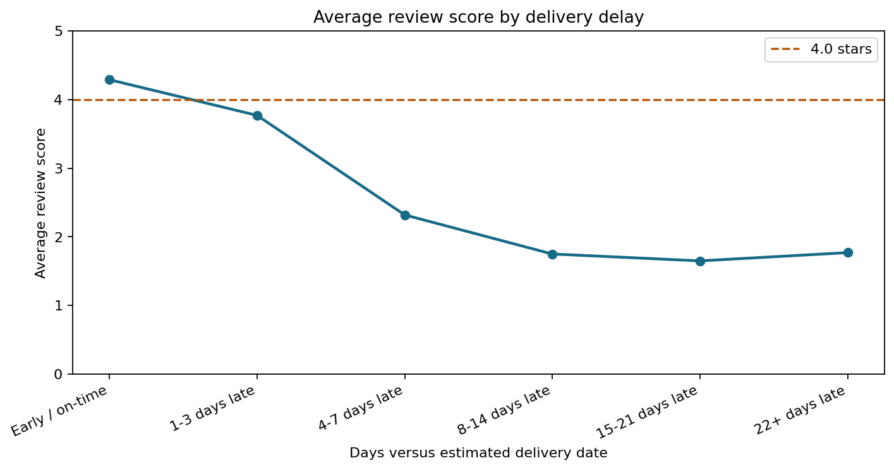
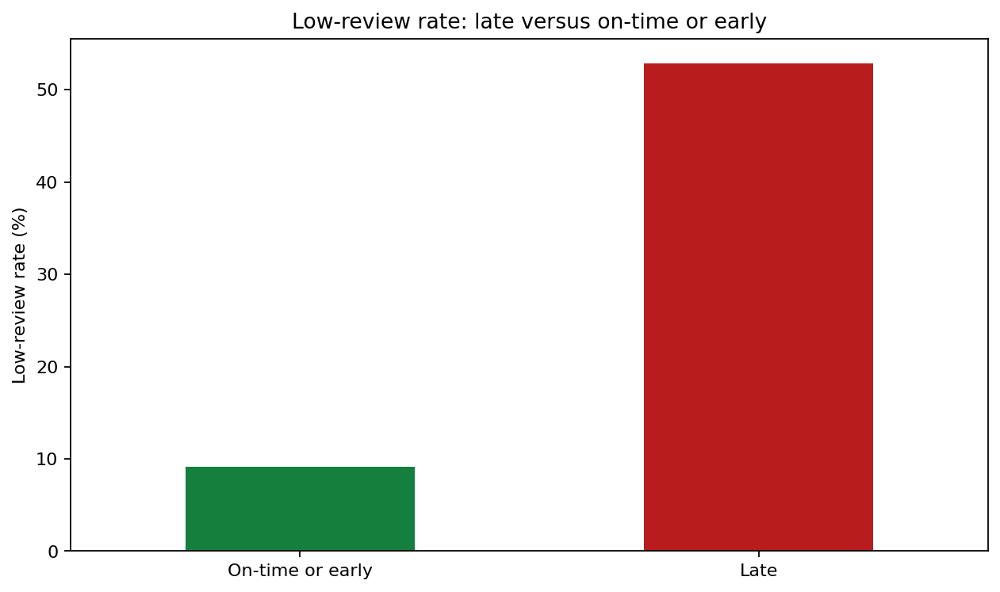
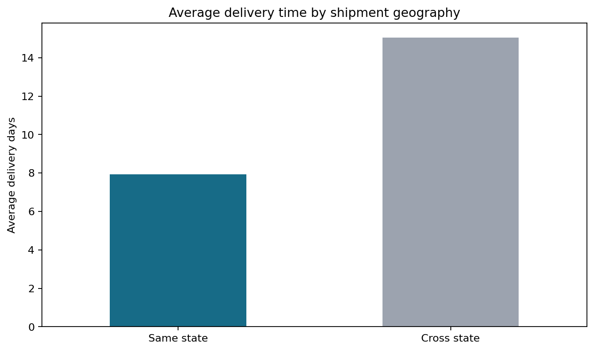

# Delivery Delay Impact Analysis

This report is generated by `scripts/build_delivery_delay_analysis.py` from
the deterministic `dashboard/data.js` output produced by the Issue #3
pipeline. It evaluates association between delivery performance and review
outcomes; it does not claim that delay alone proves causation.

## Metric scope

- Analysis unit: one order.
- Delivery-time analysis includes orders with `order_status == delivered` and a non-missing customer-delivery timestamp.
- Delay is customer-delivery date minus estimated-delivery date. Values above zero are late.
- A low review means score `<= 2`. Missing reviews are counted as not low in the late/on-time rate, matching the project metric dictionary.
- Delivered orders with a missing estimated-delivery date have no delay value and remain in the on-time/early denominator, matching the existing `is_late` definition.
- Average review scores ignore missing review scores.
- Same-state results are item-level because shipment geography is joined to order items; they are context, not a separate causal test.

## Delay bins

| Delay bin | Delivered orders | Average review | Low-review rate |
| --- | ---: | ---: | ---: |
| `Early / on-time` | 88,644 | 4.29 | 9.1% |
| `1-3 days late` | 2,662 | 3.77 | 18.9% |
| `4-7 days late` | 1,819 | 2.32 | 59.7% |
| `8-14 days late` | 1,790 | 1.75 | 76.2% |
| `15-21 days late` | 760 | 1.65 | 78.7% |
| `22+ days late` | 795 | 1.77 | 73.6% |



Average review score falls sharply through the `15-21 days late` group. The
`22+ days late` group rebounds slightly but remains at only
**1.77 stars**, below the 4.0-star guardrail, with a
low-review rate of **73.6%**.

## Late versus on-time or early

| Segment | Delivered orders | Average review | Low-review rate | Average delay days |
| --- | ---: | ---: | ---: | ---: |
| `Late` | 7,826 | 2.57 | 52.9% | 9.55 |
| `On-time or early` | 88,644 | 4.29 | 9.1% | -13.01 |



Late deliveries have a low-review rate of **52.9%**,
compared with **9.1%** for on-time or early
deliveries, or approximately **5.8x** higher. The result supports an
association between lateness and dissatisfaction under the documented
denominator rule.

## Same-state context

| Shipment segment | Item rows | Average delivery days | Average review | Late rate |
| --- | ---: | ---: | ---: | ---: |
| Same state | 39,861 | 7.93 | 4.20 | 6.0% |
| Cross state | 70,328 | 15.05 | 4.02 | 9.0% |



Same-state shipments average **7.93 days**, versus
**15.05 days** cross-state, and have a higher average
review. This difference is consistent with shorter logistics distance, but
other factors such as category, seller, and region may also contribute.

## Business recommendation

Use **22+ days late** as the first delivery-risk guardrail for investigation:
that group falls below 4.0 average stars and has a **73.6%**
low-review rate. Prioritize intervention before orders reach this threshold,
then monitor whether reducing the 22+ day population improves low-review rate.
Treat the 21-day boundary as an operational trigger, not as proof of a causal
cutoff.

## Reproduction

```bash
python3 scripts/build_delivery_delay_analysis.py
```

The command regenerates this report and the three PNG visuals in `docs/eda/`.
