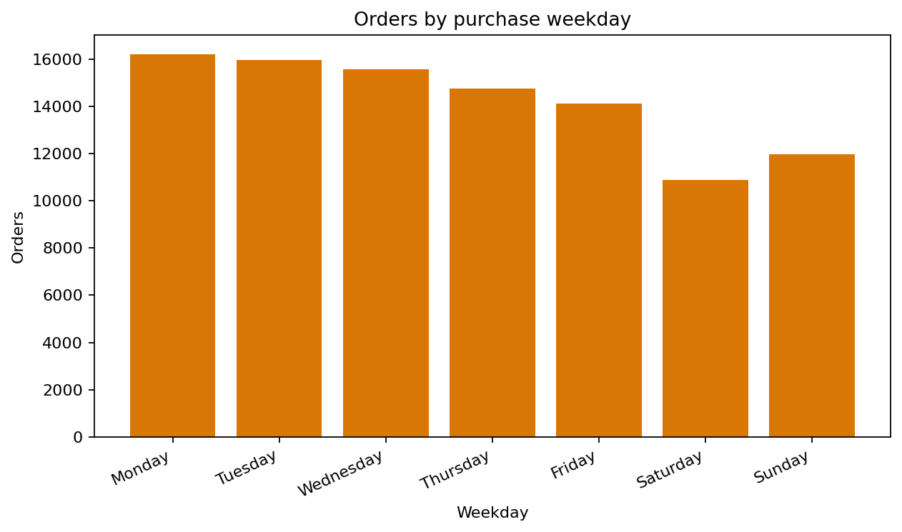
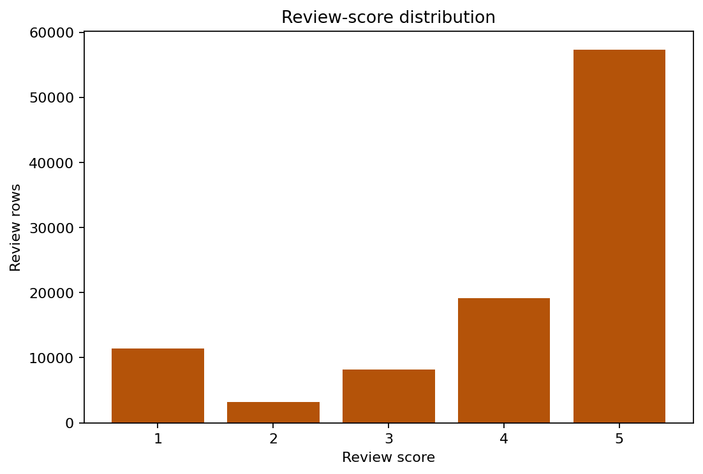
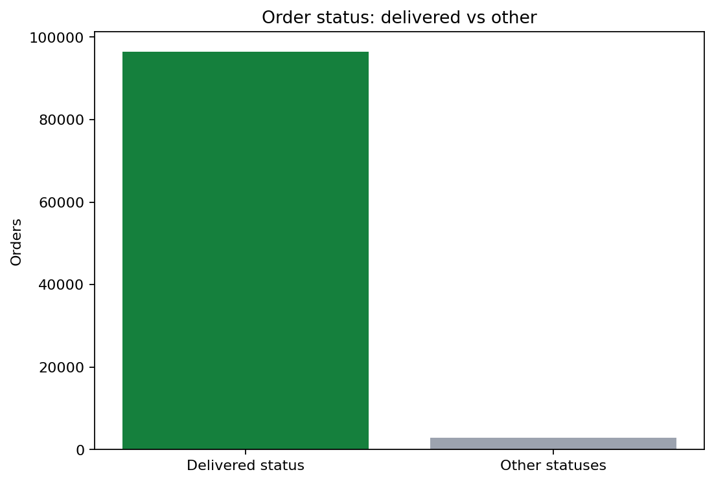

# Baseline Order-Journey EDA

This report is generated by `scripts/build_order_journey_eda.py` from the
deterministic `dashboard/data.js` output. That output is built from
`Dataviz_proj_all_datasets.xlsx` by the Issue #3 pipeline. The analysis is
order-level unless stated otherwise. It is intended to establish the
marketplace baseline before the regional, product, seller, and delivery-impact
analyses.

## Scope and data handling

- Source: `orders_dataset` and `order_reviews_dataset` through the validated dashboard pipeline.
- One row in the order table represents one order; order IDs are checked for uniqueness.
- Review distribution uses review rows directly, so an order can contribute more than one review row if present.
- A completed delivery means `order_status == delivered` and a non-missing `order_delivered_customer_date`, matching the project metric dictionary.
- No orders are removed for this baseline overview. Missing timestamps and missing reviews follow the project metric dictionary denominator rules.

## Scale snapshot

| Measure | Value |
| --- | ---: |
| Orders | 99,441 |
| Items | 112,650 |
| Sellers | 3,095 distinct sellers |
| Customers | 96,096 distinct customer identities |
| Products | 32,951 distinct products |
| Review rows | 99,224 |
| Average review score | 4.09 |
| High reviews (4-5) | 77.1% |
| Low reviews (1-2) | 14.7% |
| Orders with delivered status | 96,478 (97.0% of orders) |

## Order status

| Status | Orders |
| --- | ---: |
| `delivered` | 96,478 |
| `shipped` | 1,107 |
| `canceled` | 625 |
| `unavailable` | 609 |
| `invoiced` | 314 |
| `processing` | 301 |
| `created` | 5 |
| `approved` | 2 |

The marketplace is overwhelmingly delivered orders, but the non-delivered
statuses remain important for understanding the gap between placed orders and
successful customer completion.


## Timing patterns


Order volume peaks in **2017-11** with **7,544 orders**.
The weekday pattern peaks on **Monday** with **16,196 orders**.
These patterns provide the baseline for checking whether later segments differ
from the overall marketplace seasonality or weekly rhythm.



## Customer satisfaction



Five-star reviews are the largest group, while the low-review share is still
large enough to warrant operational investigation. The review distribution is
descriptive only here; delivery speed and category differences should be
tested in the dedicated downstream analyses.

## Delivery status coverage



This overview chart uses the exact order-status split. Delivery-time metrics
use the stricter project definition requiring both `delivered` status and a
non-missing customer-delivery timestamp; those metrics are validated by the
project pipeline separately.

## Hypotheses for deeper analysis

1. Longer delivery times are associated with lower review scores and a higher
   low-review rate; test this with delivery-day bins and late-versus-on-time
   comparisons.
2. The marketplace's overall satisfaction hides category and regional risk;
   test whether high-volume categories or states combine meaningful demand
   with worse delivery or review outcomes.
3. The weekday and monthly demand pattern may change the operational load on
   sellers; test whether peak periods have higher delays after controlling for
   category and region.

## Reproduction

```bash
python3 scripts/build_order_journey_eda.py
```

The command regenerates this report and the five PNG visuals in `docs/eda/`.
