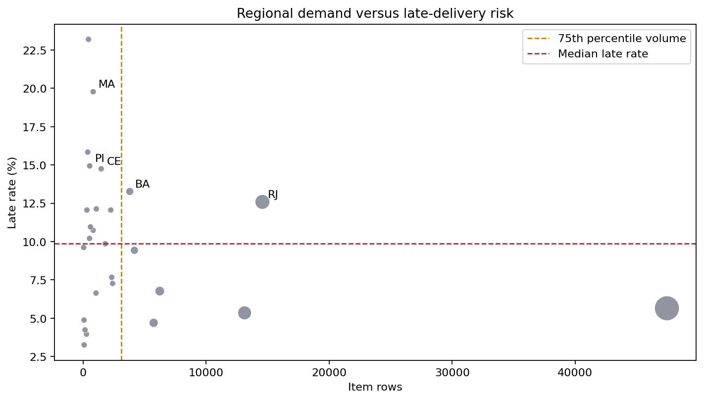

# Regional Demand, Delivery, and Satisfaction Analysis

This report is generated by scripts/build_regional_analysis.py from the
deterministic dashboard/data.js output produced by the shared pipeline.
Regional metrics use customer state and item-level joins, as defined in the
project metric dictionary.

## Method and guardrails

- Demand is measured by item rows and item-price revenue by customer state.
- Delivery and satisfaction metrics use the pipeline's delivered-item rules.
- States with fewer than **500 item rows** are excluded from the risk ranking to reduce small-sample volatility.
- The risk chart shows all states, but its highlighted risk table uses the minimum-volume rule.
- State comparisons are descriptive and do not prove that geography alone causes delay or low reviews.

## Demand concentration

The top three states by revenue account for **63.4%** of total
state-level item revenue. This concentration makes improvements in major
markets more consequential, but volume alone is not a reason to invest without
checking delivery and satisfaction.

### Top states by item volume

| State | Item rows | Revenue | Average review | Late rate |
| --- | ---: | ---: | ---: | ---: |
| SP | 47,449 | 5,202,955.05 | 4.13 | 5.7% |
| RJ | 14,579 | 1,824,092.67 | 3.81 | 12.6% |
| MG | 13,129 | 1,585,308.03 | 4.09 | 5.3% |
| RS | 6,235 | 750,304.02 | 4.05 | 6.8% |
| PR | 5,740 | 683,083.76 | 4.11 | 4.7% |
| SC | 4,176 | 520,553.34 | 4.00 | 9.4% |
| BA | 3,799 | 511,349.99 | 3.81 | 13.3% |
| DF | 2,406 | 302,603.94 | 4.01 | 7.3% |
| GO | 2,333 | 294,591.95 | 3.99 | 7.7% |
| ES | 2,256 | 275,037.31 | 3.99 | 12.1% |

### Top states by revenue

| State | Item rows | Revenue | Average review | Late rate |
| --- | ---: | ---: | ---: | ---: |
| SP | 47,449 | 5,202,955.05 | 4.13 | 5.7% |
| RJ | 14,579 | 1,824,092.67 | 3.81 | 12.6% |
| MG | 13,129 | 1,585,308.03 | 4.09 | 5.3% |
| RS | 6,235 | 750,304.02 | 4.05 | 6.8% |
| PR | 5,740 | 683,083.76 | 4.11 | 4.7% |
| SC | 4,176 | 520,553.34 | 4.00 | 9.4% |
| BA | 3,799 | 511,349.99 | 3.81 | 13.3% |
| DF | 2,406 | 302,603.94 | 4.01 | 7.3% |
| GO | 2,333 | 294,591.95 | 3.99 | 7.7% |
| ES | 2,256 | 275,037.31 | 3.99 | 12.1% |

## Delivery-risk view

The risk ranking uses at least 500 item rows per state and is ordered
by late rate, then average delivery time. The largest late-rate values should
be interpreted alongside volume and review metrics rather than treated as
standalone priorities.

| State | Item rows | Revenue | Average delivery days | Late rate | Low-review rate |
| --- | ---: | ---: | ---: | ---: | ---: |
| MA | 824 | 119,648.22 | 21.65 | 19.8% | 23.3% |
| PI | 542 | 86,914.08 | 19.38 | 14.9% | 18.4% |
| CE | 1,478 | 227,254.71 | 20.99 | 14.8% | 21.0% |
| BA | 3,799 | 511,349.99 | 19.25 | 13.3% | 19.9% |
| RJ | 14,579 | 1,824,092.67 | 15.15 | 12.6% | 22.2% |
| PA | 1,080 | 178,947.81 | 23.75 | 12.1% | 20.6% |
| ES | 2,256 | 275,037.31 | 15.65 | 12.1% | 15.9% |
| PB | 602 | 115,268.08 | 20.59 | 11.0% | 17.1% |
| MS | 819 | 116,812.64 | 15.53 | 10.7% | 16.5% |
| RN | 529 | 83,034.98 | 19.33 | 10.2% | 15.1% |

## Priority regions

The following view combines high demand (at or above the 75th percentile of
state item volume) with at-or-above-median late rate. It is a prioritization
screen, not a causal model.

| State | Item rows | Revenue | Late rate | Average review |
| --- | ---: | ---: | ---: | ---: |
| RJ | 14,579 | 1,824,092.67 | 12.6% | 3.81 |
| BA | 3,799 | 511,349.99 | 13.3% | 3.81 |

## Seller-state and customer-state context

Same-state shipments average **7.93**
delivery days versus **15.05**
cross-state, with late rates of **6.0%**
and **9.0%**, respectively. This
supports treating logistics distance as a useful supporting factor; seller
quality, category mix, and destination mix still need to be considered.

## Recommendation

Prioritize operational review in the intersection of high demand and elevated
late rate, starting with the priority table above. For lower-volume states,
continue monitoring until at least 500 item rows are available before
making a firm regional investment decision. Pair regional actions with monthly
late-rate, delivery-time, and low-review monitoring.

## Reproduction

    python3 scripts/build_regional_analysis.py

The command regenerates this report and the two PNG visuals in docs/eda/.
