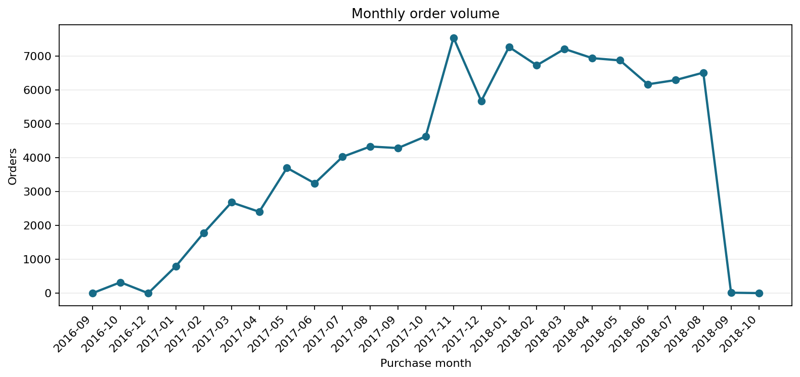
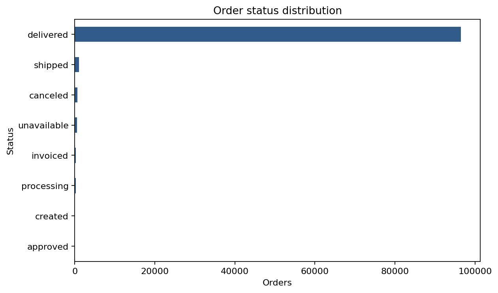
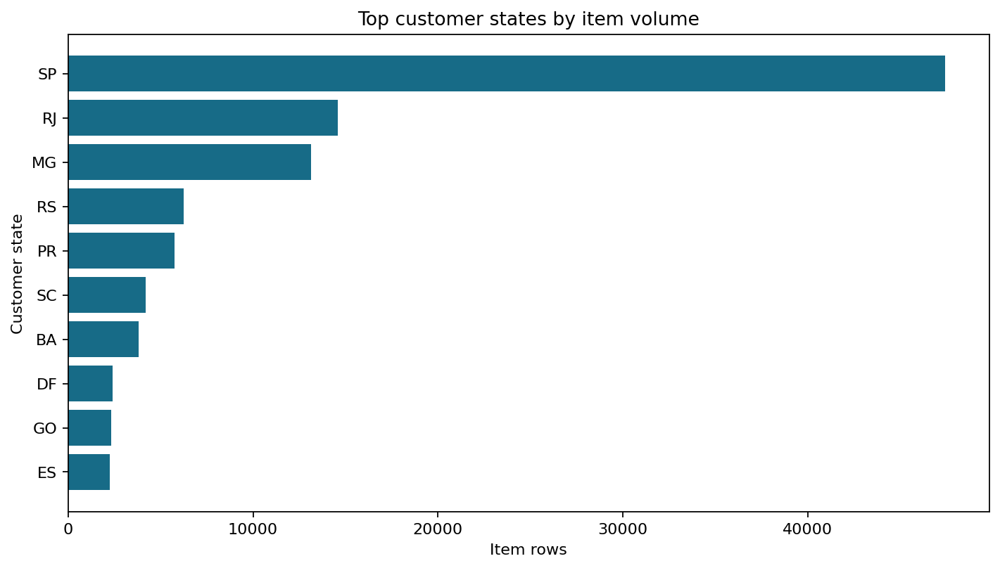
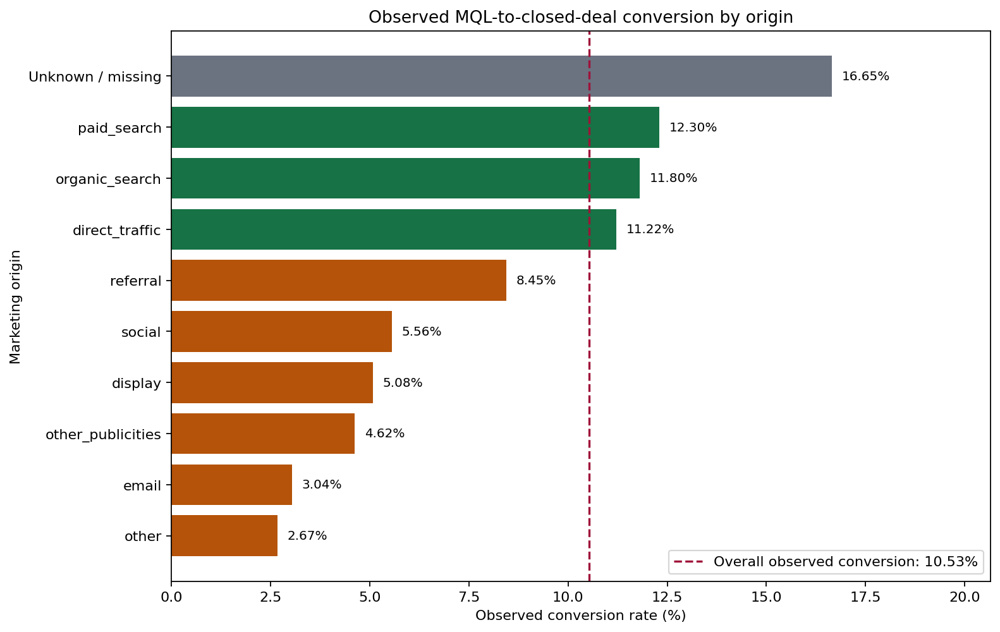

# A Visual Study of E-Commerce Orders, Delivery and Customer Satisfaction

**Final Technical Report - Group 3**  
**Indian Institute of Technology Madras - BS Degree Programme**  
**Data Visualization Design Project, May 2026**

> **Project objective:** Grow the marketplace without breaking the customer experience.

## Submission Details

| Field | Value |
| --- | --- |
| Team | Group 3 |
| Submission date | `[DD Month YYYY]` |
| Document status | Final working copy |
| Live dashboard | <https://22f3002680.github.io/Dataviz-project-Group3/> |
| Repository | <https://github.com/22f3002680/Dataviz-project-Group3> |

## Team Members

| Member | Full name | Roll number | Primary responsibility |
| ---: | --- | --- | --- |
| 1 | `[FULL NAME]` | `[ROLL NUMBER]` | `[ROLE / DELIVERABLES]` |
| 2 | `[FULL NAME]` | `[ROLL NUMBER]` | `[ROLE / DELIVERABLES]` |
| 3 | `[FULL NAME]` | `[ROLL NUMBER]` | `[ROLE / DELIVERABLES]` |
| 4 | `[FULL NAME]` | `[ROLL NUMBER]` | `[ROLE / DELIVERABLES]` |
| 5 | `[FULL NAME]` | `[ROLL NUMBER]` | `[ROLE / DELIVERABLES]` |

Every member must complete the detailed contribution log in Appendix C before submission.

## Contents

1. Executive Summary
2. Project Context and Business Problem
3. Objectives, Scope and Analysis Questions
4. Data Preparation and Analytical Method
5. Marketplace and Order Journey
6. Delivery Reliability and Customer Satisfaction
7. Product Category and Seller Performance
8. Regional Demand and Operational Risk
9. Growth and Marketing Funnel
10. Recommendations and Decision Framework
11. Limitations, Constraints and Improvements
12. Interactive Dashboard and Evidence Directory
13. Conclusion
14. Appendix A - Technical Reproduction Guide
15. Appendix B - Metric Definitions and Validation
16. Appendix C - Individual Contribution Logs
17. Appendix D - Evaluation Criteria Mapping

Google Docs readers can use the document outline to navigate every numbered section. Section 11 maps each question to the correct dashboard view and supporting report.

# Executive Summary

The leadership problem is a trade-off: grow catalogue breadth, sellers and orders without allowing delivery failures or poor product experiences to drive customers away. This project converts the full marketplace order journey into an evidence-based visual story. It combines order, item, product, seller, customer, payment, review, geolocation and marketing-funnel tables; applies explicit grain and denominator rules; validates dashboard metrics independently; and publishes the results through an interactive dashboard and focused analytical reports.

The marketplace contains **99,441 orders**, **112,650 item rows**, **96,096 unique customers**, **3,095 sellers**, **32,951 products** and **74 normalized product categories**. The average review is **4.09 out of 5**, and **77.1%** of reviews are four or five stars. These aggregate results are strong, but they hide a sharp service-risk pattern.

> **Key message:** Delivery reliability is the clearest operational signal associated with customer dissatisfaction.

Delivered orders take **12.6 days** on average, with a **10.2-day median**. The late-delivery rate is **8.1%**. Among late delivered orders, **52.8%** receive a low review, compared with **9.1%** among on-time delivered orders. Average review declines from **4.48** for delivery within three days to **3.12** for delivery taking 22 days or more; the low-review rate rises from **6.6%** to **38.2%** across the same bands.

Risk is concentrated rather than uniform. Office furniture has a **25.9%** low-review rate and **20.8-day** average delivery time. High-volume categories such as furniture decor, bed bath table and computer accessories combine meaningful demand with 18%-19% low-review rates. Rio de Janeiro and Bahia combine substantial demand with elevated delivery risk. Same-state fulfilment averages **7.9 days** and a **6.0%** late rate, compared with **15.1 days** and **9.0%** for cross-state fulfilment.

Growth should therefore be selective. Sports and leisure, housewares, auto, perfumery, stationery and pet shop show strong equal-window growth while maintaining 2018 review scores of at least 4.0 and late rates at or below 10%. Seller governance should similarly separate healthy sellers from intervention candidates instead of applying one rule to the entire network.

The marketing snapshot contains **8,000 marketing-qualified leads** and **842 observed closed deals**, an observed conversion rate of **10.5%**. Only **45.1%** of closed sellers link to marketplace item activity, and origin comparisons are observational. Marketing results are therefore supporting context, not causal spend recommendations.

The recommended sequence is to protect delivery reliability, intervene where volume and experience risk overlap, scale categories and sellers that pass service guardrails, improve geographic matching, and repair marketing attribution before reallocating acquisition spend.

# 1. Project Context and Business Problem

The marketplace connects small and medium-sized sellers with customers across Brazil. Leadership wants to increase gross sales and catalogue depth, but rapid seller onboarding can increase handling variation, shipment distance and customer-service risk. Removing every slow seller may improve averages while reducing assortment and suppressing growth. The analytical task is to identify where growth and satisfaction can coexist and where targeted intervention is justified.

The project follows the complete customer journey: order placement, payment, seller handling, freight, delivery and the review submitted after purchase. It asks which delivery patterns, categories, seller behaviours and regions are associated with positive experiences and which combinations signal hidden risk. The intended audience is marketplace leadership and teams responsible for seller success, logistics, customer experience and growth.

## 1.1 Decision Principle

The analysis uses a guardrail approach. A segment is considered suitable for growth only when demand or momentum is accompanied by acceptable review and delivery outcomes. A segment becomes an intervention priority when meaningful business volume overlaps with elevated late delivery, long delivery time or low-review rates.

## 1.2 Connected Deliverables

The project produces an interactive marketplace dashboard, focused explanatory reports, and a reproducible repository. The dashboard supports comparison by category, seller, region, delivery performance and growth. The reports explain the methods and conclusions. The repository contains the workbook, notebooks, deterministic build scripts, metric definitions, validation scripts and quality documentation.

# 2. Objectives, Scope and Analysis Questions

## 2.1 Objectives

1. Translate the business goal into measurable questions and decision rules.
2. Build a reproducible multi-table preparation pipeline with explicit quality handling.
3. Use exploratory visualization to reveal order structure, review distribution, seasonality and delivery patterns.
4. Build explanatory views that identify high-impact customer-experience risks and healthy growth opportunities.
5. Communicate a focused recommendation through a responsive, accessible dashboard and traceable technical report.

## 2.2 Final Analysis Questions

1. How do order volume, status and review outcomes change across the observed period?
2. How strongly are delivery time and late delivery associated with customer satisfaction?
3. Which product categories combine commercial importance with customer-experience risk?
4. Which sellers appear healthy enough to support growth, and which require intervention?
5. Which customer regions combine high demand with elevated delivery and satisfaction risk?
6. Does same-state fulfilment produce better delivery outcomes than cross-state fulfilment?
7. Which categories show healthy growth under minimum-review and maximum-late-rate guardrails?
8. What does the marketing funnel reveal about observed seller acquisition, linkage and early activation?

## 2.3 Scope

The primary analysis uses the supplied Brazilian e-commerce marketplace tables. Marketing funnel tables are supporting context. Delivery analysis is limited to delivered orders with usable timestamps. Revenue uses item price and excludes freight unless explicitly stated. Results are descriptive and observational; they do not establish causal effects.

# 3. Data Preparation and Analytical Method

## 3.1 Relational Data Model

Orders provide status and timestamps. Order items connect orders to products and sellers and contain price and freight. Customers and sellers provide locations. Products provide categories. Reviews provide satisfaction scores. Payments provide payment context. Category translation normalizes category labels. Geolocation supports geographic interpretation. Marketing-qualified leads and closed deals provide the supplementary acquisition funnel.

The central join path uses `order_id` from orders to items, reviews and payments; `product_id` from items to products; `seller_id` from items to sellers; `customer_id` from orders to customers; and `mql_id` from marketing-qualified leads to closed deals. Grain is controlled so one-to-many joins do not duplicate order-level metrics.

## 3.2 Data Quality Decisions

The audit checks schemas, key uniqueness, missing values, orphan keys, timestamp parsing, impossible timestamp sequences, translation coverage and join cardinality. Invalid chronology is handled conservatively: the order remains available for analyses that do not require the invalid timestamp, while the affected duration is excluded rather than imputed as observed truth.

Missing review scores are not classified as negative reviews. Undelivered orders and rows without valid delivery timestamps are excluded from delivery duration and late-rate calculations. Missing translations fall back to the source category and then to `unknown`. Regional and category risk rankings require at least 500 item rows. Risk sellers require at least 50 orders; healthy sellers require at least 80.

## 3.3 Derived Measures and Guardrails

Delivery days equals delivered-customer timestamp minus purchase timestamp for valid delivered orders. Late delivery identifies valid delivered orders delivered after the estimated date. Low review means score 1 or 2; high review means score 4 or 5. Revenue is the sum of item price. Same-state fulfilment compares customer and seller state at item level.

Growth uses equal January-August windows in 2017 and 2018. Healthy growth requires at least 50 items in 2017, 100 in 2018, a 2018 average review of at least 4.0 and a 2018 late rate no greater than 10%.

## 3.4 Validation

Dashboard data is generated deterministically from the committed workbook. An independent validator recomputes summary KPIs, row counts, review distribution, delivery bins, category rankings, state rankings, seller lists and growth categories. The marketing validator checks source keys, funnel totals, marketplace linkage, equal 30-day observation windows and single-seller review attribution. Browser QA covers all six views at desktop, tablet and mobile widths.

# 4. Marketplace and Order Journey

## 4.1 Marketplace Scale

The dataset contains 99,441 orders and 112,650 item rows across 96,096 unique customers, 3,095 sellers, 32,951 products and 74 categories. Orders classified as delivered with a delivery timestamp represent 97.0% of all orders. The network scale makes aggregate averages useful for context but insufficient for operational decisions.

## 4.2 Order Volume and Outcomes



**Figure 1.** Monthly marketplace order volume. Boundary months are partial and should not be treated as full-month comparisons.

The observed period shows rapid marketplace expansion through 2017 and into 2018. Operational capacity and seller controls must scale with demand because rising order volume increases the absolute impact of even a stable late-delivery percentage.



**Figure 2.** Distribution of order outcomes.

Most orders reach delivered status. Canceled, unavailable and incomplete outcomes remain separate operational signals, but they are excluded from delivery-duration averages because they do not contain a valid delivered journey.

## 4.3 Review Distribution

The average review is 4.09. Five-star reviews account for 57.8% of review rows, four-star reviews 19.3%, three-star reviews 8.2%, two-star reviews 3.2% and one-star reviews 11.5%. The distribution is polarized: a strong majority is satisfied, but one-star experiences form an important tail that aggregate averages hide.

# 5. Delivery Reliability and Customer Satisfaction

## 5.1 Delivery-Time Gradient


**Figure 3.** Average review and low-review rate by total delivery-time range.

The satisfaction gradient is monotonic. Orders delivered within 0-3 days average 4.48 stars with a 6.6% low-review rate. At 4-7 days the values are 4.40 and 7.6%; at 8-14 days, 4.31 and 8.9%; at 15-21 days, 4.14 and 11.6%; and at 22 days or more, 3.12 and 38.2%.

This pattern does not prove delivery duration alone causes review scores, but its size and consistency make speed a practical customer-experience guardrail. The 22-day band is especially useful for intervention because dissatisfaction rises materially.

## 5.2 Late Delivery

The overall late rate is 8.1%. Late delivered orders have a 52.8% low-review rate, compared with 9.1% for on-time delivered orders. This identifies a measurable service failure with a clear operational owner. The dashboard exposes both missed promises and delivery-time bands so teams can distinguish lateness from generally slow but correctly estimated journeys.

## 5.3 Geographic Fulfilment

Same-state item shipments average 7.93 delivery days, R$13.45 freight and a 5.98% late rate. Cross-state shipments average 15.05 days, R$23.63 freight and a 9.00% late rate. Same-state fulfilment also has a higher average review, 4.20 versus 4.02. The result supports local inventory placement and geographic matching as testable strategies.

## 5.4 Operational Implication

Delivery improvement should prevent missed estimated dates, reduce the tail beyond 22 days and improve geographic matching where demand permits. Weekly monitoring should combine volume, late rate, median delivery time, 22-plus-day share and low-review rate. A seller or region should not be penalized on one rate without checking volume, category mix and destination mix.

# 6. Product Category and Seller Performance

## 6.1 Commercial Importance

Bed bath table is largest by item volume with 11,115 items. Health and beauty follows with 9,670 items and leads revenue at approximately R$1.26 million. Watches and gifts contributes R$1.21 million, bed bath table R$1.04 million and sports and leisure R$0.99 million.

## 6.2 Category Risk

Office furniture has the highest low-review rate among categories meeting the threshold: 25.9%, with a 3.49 average review and 20.84-day average delivery. Furniture decor has 8,334 items and a 19.0% low-review rate. Bed bath table has 11,115 items and an 18.5% low-review rate. Computer accessories has 7,827 items and an 18.4% low-review rate.

Office furniture is a severity priority. Bed bath table, furniture decor and computer accessories are scale priorities because weaker experience affects much larger volumes. Follow-up should separate delivery issues from product quality, packaging, listing accuracy and seller handling.

## 6.3 Seller Segmentation

Healthy sellers have at least 80 orders, average review of at least 4.1 and late rate no greater than 8%. Risk sellers have at least 50 orders and rank poorly on review, low-review rate or lateness.

A healthy Sao Paulo seller, `7a67c85e85bb2ce8582c35f2203ad736`, records 1,160 orders, a 4.23 review average and 5.81% late rate. A high-volume risk seller in Itaquaquecetuba, `7c67e1448b00f6e969d365cea6b010ab`, records 982 orders, a 3.34 review average, a 29.33% low-review rate and 22.39 average delivery days. These cases show why seller governance should be differentiated.

Healthy sellers should receive growth support subject to continued guardrails. Risk sellers should enter a diagnosis covering handling time, inventory accuracy, carrier performance, category mix and destinations. Enforcement should follow failed remediation or repeated breaches rather than one observation.

# 7. Regional Demand and Operational Risk

## 7.1 Demand Concentration



**Figure 4.** Top customer states by item volume and item-price revenue.

Sao Paulo dominates with 47,449 item rows and approximately R$5.20 million in revenue. Rio de Janeiro follows with 14,579 items and R$1.82 million, and Minas Gerais with 13,129 items and R$1.59 million. The top three states account for 63.4% of state-level revenue.

## 7.2 Risk Ranking

Among states with at least 500 items, Maranhao has the highest late rate at about 19.8%, followed by Piaui at 14.9%, Ceara at 14.8%, Bahia at 13.3% and Rio de Janeiro at 12.6%. Volume changes priority: Rio de Janeiro combines 14,579 items with 12.6% late and 22.2% low reviews; Bahia combines 3,799 items with 13.3% late and 19.9% low reviews.

The regional report identifies Rio de Janeiro and Bahia as high-demand, elevated-risk priorities. Lower-volume high-risk states remain monitoring and diagnostic priorities, but major investment should wait for sufficient sample and local context.

## 7.3 Regional Decision Screen

High-demand, high-risk states warrant immediate investigation. High-demand, low-risk states should be protected during growth. Low-demand, high-risk states should be monitored for structural constraints. Low-demand, low-risk states are lower priority unless they support a strategic expansion.

# 8. Growth and Marketing Funnel

## 8.1 Healthy Category Growth

Sports and leisure increased item volume by 120.0% and revenue by 134.0%, with a 4.05 review and 9.0% late rate. Housewares increased items by 138.3% and revenue by 198.5%, with a 4.05 review and 7.7% late rate. Auto increased items by 221.3% and revenue by 161.5%, with a 4.10 review and 8.7% late rate.

Stationery, pet shop, perfumery, musical instruments and small appliances also pass the guardrails. These are candidate growth categories, not automatic investment decisions. Leadership should also verify margin, supply capacity, seller concentration and whether quality remains stable as volume grows.

## 8.2 Marketing Funnel



**Figure 5.** Observed marketing-qualified leads and closed deals by reported origin.

The snapshot contains 8,000 MQLs and 842 observed closed deals, producing a 10.5% observed conversion rate. Unmatched leads are not called failures because the snapshot may not capture all later outcomes. Paid and organic search contribute substantial lead and win volume, while missing origin attribution remains material.

Only 45.13% of closed sellers link to marketplace item activity. Linked-seller analysis uses a fixed 30-day post-win window. Multi-seller orders are excluded from seller-attributed review comparisons because one order review cannot be assigned reliably to multiple sellers.

## 8.3 Interpretation Guardrails

Marketing origin is observational and does not establish that a channel caused conversion or seller performance. Small origins produce unstable rates. Missing origin is an attribution problem, not a channel. Improve source tracking and use controlled experiments before changing spend.

# 9. Recommendations and Decision Framework

## 9.1 Protect the Delivery Promise

Create alerts for orders beyond the estimated date and a separate long-tail queue for orders projected beyond 22 days. Track late rate, median delivery time, 22-plus-day share and low-review rate by seller, category and customer state.

## 9.2 Intervene Where Volume and Risk Overlap

Begin category diagnosis with office furniture for severity and bed bath table, furniture decor and computer accessories for scale. Begin regional investigation with Rio de Janeiro and Bahia. Use root-cause reviews rather than blanket penalties.

## 9.3 Scale Proven Healthy Segments

Support categories that pass review and delivery guardrails, including sports and leisure, housewares and auto. Use the healthy-seller list to identify suppliers that can absorb demand. Re-evaluate monthly and withdraw support if quality deteriorates.

## 9.4 Improve Geographic Matching

Test same-state or closer-state fulfilment for high-demand products through local inventory, seller recommendations by customer region and carrier routing changes. Evaluate pilots with comparable categories and states rather than assuming causality.

## 9.5 Repair Marketing Attribution

Standardize origin capture and preserve campaign identifiers through closed-deal and marketplace linkage. Use the 30-day activation framework as an early seller-quality signal. Do not reallocate spend solely from the observational snapshot.

## 9.6 Management Scorecard

Growth measures: orders, item-price revenue, active sellers and healthy-growth category volume.

Experience measures: average review, low-review rate, late rate, median delivery days and 22-plus-day share.

Risk controls: minimum sample thresholds, equal-window comparisons, seller review queues and attribution completeness.

Decision rule: expand only when growth improves without breaching experience guardrails; intervene when meaningful volume overlaps with persistent service risk.

# 10. Limitations, Constraints and Improvements

## 10.1 Data Limitations

The data is historical and represents one marketplace snapshot. Reviews can be influenced by product quality, expectations, communication and price in addition to delivery. Order reviews cannot be assigned reliably to individual sellers in multi-seller orders. Item-level joins can repeat an order, so item and order metrics remain separate.

Timestamp problems are not imputed as observed events. Marketing attribution is incomplete, and fewer than half of closed sellers link to marketplace activity. Revenue excludes freight and does not represent profit. Returns, refunds, service contacts and repeat purchases are unavailable.

## 10.2 Analytical Constraints

The project uses descriptive segmentation rather than causal modelling. Minimum-volume rules improve stability but remain business thresholds. Year-over-year growth uses equal January-August windows but does not remove every seasonal or composition effect.

## 10.3 Improvements

Future work should add uncertainty intervals, cohort retention, repeat purchases, returns, carrier performance, seller handling time, margin and product-defect signals. Controlled pilots should test geographic matching and seller interventions. The dashboard can add date filters, downloadable segment tables, benchmark selectors and threshold controls while preserving validation and accessibility.

# 11. Interactive Dashboard and Evidence Directory

| Analysis question | Dashboard view | Detailed evidence |
| --- | --- | --- |
| Marketplace scale, order trend and reviews | [Overview](https://22f3002680.github.io/Dataviz-project-Group3/#overview) | [Order journey report](https://22f3002680.github.io/Dataviz-project-Group3/reports/order-journey.html) |
| Delivery time, lateness and satisfaction | [Delivery](https://22f3002680.github.io/Dataviz-project-Group3/#delivery) | [Delivery impact report](https://22f3002680.github.io/Dataviz-project-Group3/reports/delivery-impact.html) |
| Category demand, revenue and risk | [Categories](https://22f3002680.github.io/Dataviz-project-Group3/#categories) | [Product analysis](https://22f3002680.github.io/Dataviz-project-Group3/reports/product-analysis.html) |
| Geographic demand and delivery risk | [Regions](https://22f3002680.github.io/Dataviz-project-Group3/#regions) | [Regional analysis](https://22f3002680.github.io/Dataviz-project-Group3/reports/regional-analysis.html) |
| Healthy and intervention sellers | [Sellers](https://22f3002680.github.io/Dataviz-project-Group3/#sellers) | [Seller analysis](https://22f3002680.github.io/Dataviz-project-Group3/reports/seller-analysis.html) |
| Healthy growth and acquisition context | [Growth](https://22f3002680.github.io/Dataviz-project-Group3/#growth) | [Marketing funnel](https://22f3002680.github.io/Dataviz-project-Group3/reports/marketing-funnel.html) |

Reports index: <https://22f3002680.github.io/Dataviz-project-Group3/reports/index.html>  
Repository: <https://github.com/22f3002680/Dataviz-project-Group3>  
Issue 12: <https://github.com/22f3002680/Dataviz-project-Group3/issues/12>  
Source brief: <https://docs.google.com/document/d/e/2PACX-1vTK3D-jGSwK2p0mPOOeC7SieNxD137LHUBW1-iF4B0VH4Y_7GNdwQ53GZeNoCRU8KWgW-XyJclYPuNn/pub>

# 12. Conclusion

The marketplace can grow without sacrificing customer experience, but only through selective expansion with service guardrails. Delivery is the strongest operational risk signal in the available data. Risk is concentrated in specific category, seller and regional combinations, while several categories and sellers demonstrate that growth and strong experience can coexist.

The recommended operating model is targeted rather than punitive: protect the delivery promise, prioritize commercially meaningful risk, support proven healthy segments, improve geographic matching and strengthen attribution before changing acquisition spend. The dashboard and linked evidence reports turn this model into a repeatable decision workflow.

# Appendix A - Technical Reproduction Guide

## A.1 Repository Structure

`dashboard/` contains the static GitHub Pages application, data and reports. `docs/` contains scope, quality decisions, metric definitions, analysis narratives and QA evidence. `scripts/` contains deterministic builders and validators. The root contains the source workbook and exploratory notebooks.

## A.2 Build and Validation

```bash
python3 scripts/build_dashboard_data.py
python3 scripts/build_order_journey_eda.py
python3 scripts/build_delivery_delay_analysis.py
python3 scripts/build_regional_analysis.py
python3 scripts/build_marketing_funnel_analysis.py
python3 scripts/build_live_report_pages.py
python3 scripts/validate_dashboard_metrics.py
python3 scripts/validate_marketing_funnel_analysis.py
node --check dashboard/app.js
git diff --check
```

Preview with `python3 -m http.server 8000`, then open `http://localhost:8000/dashboard/#overview`.

## A.3 Deployment

Merges to `project-materials` trigger the `Deploy dashboard to GitHub Pages` workflow, which publishes `dashboard/` to `gh-pages`. Acceptance requires a successful run and HTTP 200 responses for the dashboard and reports.

# Appendix B - Metric Definitions and Validation

| Metric | Grain | Definition |
| --- | --- | --- |
| Orders | Order | Count of rows in the orders table |
| Delivered rate | Order | Delivered orders with delivered timestamp / all orders |
| Average review | Review | Mean score across review rows |
| Low-review rate | Relevant reviewed grain | Share with score 1 or 2 |
| Late-delivery rate | Delivered order | Delivered after estimated date / valid delivered orders |
| Delivery days | Delivered order | Purchase timestamp to delivered-customer timestamp |
| Revenue | Item | Sum of item price, excluding freight |
| Observed conversion | MQL | MQLs matched to a closed deal / all MQLs |

Order metrics use one row per order. Category, seller, revenue and regional demand use item rows because product, seller and price live on items. Marketing metrics use MQL or closed-seller grain as stated.

Validation evidence: 35 dashboard metric checks, 27 marketing-funnel checks, 121 responsive browser QA checks and successful live-route verification.

# Appendix C - Individual Contribution Logs

Every member must replace one block with concrete evidence: issue numbers, PRs, commits, files, notebook sections, charts, review comments and dated work-log entries.

## C.1 Team Member 1 - `[FULL NAME]` (`[ROLL NUMBER]`)

- Role: `[PRIMARY ROLE]`
- GitHub username: `[USERNAME]`
- Issues and PRs: `[NUMBERS AND LINKS]`
- Main artifacts: `[FILES / ANALYSES / VISUALS]`
- Work log: `[DATE - TASK - RESULT]`
- Peer review: `[LINKS]`
- Declaration: I confirm this contribution record is complete and accurate.

## C.2 Team Member 2 - `[FULL NAME]` (`[ROLL NUMBER]`)

- Role: `[PRIMARY ROLE]`
- GitHub username: `[USERNAME]`
- Issues and PRs: `[NUMBERS AND LINKS]`
- Main artifacts: `[FILES / ANALYSES / VISUALS]`
- Work log: `[DATE - TASK - RESULT]`
- Peer review: `[LINKS]`
- Declaration: I confirm this contribution record is complete and accurate.

## C.3 Team Member 3 - `[FULL NAME]` (`[ROLL NUMBER]`)

- Role: `[PRIMARY ROLE]`
- GitHub username: `[USERNAME]`
- Issues and PRs: `[NUMBERS AND LINKS]`
- Main artifacts: `[FILES / ANALYSES / VISUALS]`
- Work log: `[DATE - TASK - RESULT]`
- Peer review: `[LINKS]`
- Declaration: I confirm this contribution record is complete and accurate.

## C.4 Team Member 4 - `[FULL NAME]` (`[ROLL NUMBER]`)

- Role: `[PRIMARY ROLE]`
- GitHub username: `[USERNAME]`
- Issues and PRs: `[NUMBERS AND LINKS]`
- Main artifacts: `[FILES / ANALYSES / VISUALS]`
- Work log: `[DATE - TASK - RESULT]`
- Peer review: `[LINKS]`
- Declaration: I confirm this contribution record is complete and accurate.

## C.5 Team Member 5 - `[FULL NAME]` (`[ROLL NUMBER]`)

- Role: `[PRIMARY ROLE]`
- GitHub username: `[USERNAME]`
- Issues and PRs: `[NUMBERS AND LINKS]`
- Main artifacts: `[FILES / ANALYSES / VISUALS]`
- Work log: `[DATE - TASK - RESULT]`
- Peer review: `[LINKS]`
- Declaration: I confirm this contribution record is complete and accurate.

# Appendix D - Evaluation Criteria Mapping

| Criterion | Report evidence |
| --- | --- |
| Approach | Sections 1-3: framing, questions, relational model, quality decisions, measures and validation |
| Data analysis and findings | Sections 4-8: order journey, delivery, category, seller, region, growth and marketing |
| Data visualization | Figures 1-5 and the six linked dashboard views |
| Implications | Section 9: sequenced operating framework |
| Constraints and improvements | Section 10: data, analytical and dashboard limitations plus extensions |
| Presentation | Executive Summary, numbered story and interactive dashboard |
| Technical appendix | Appendices A-B: commands, structure, metrics, grain and validation |
| Consistent progress | Appendix C: issue ownership, PRs, artifacts and work logs |
